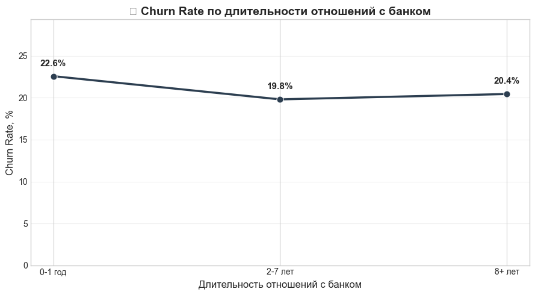
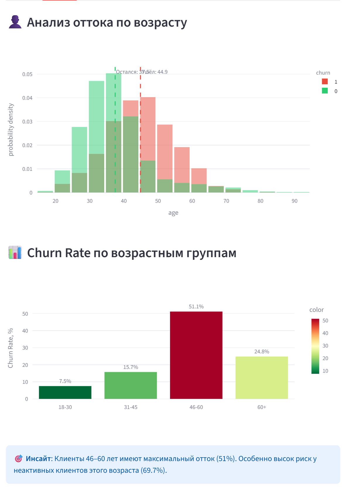
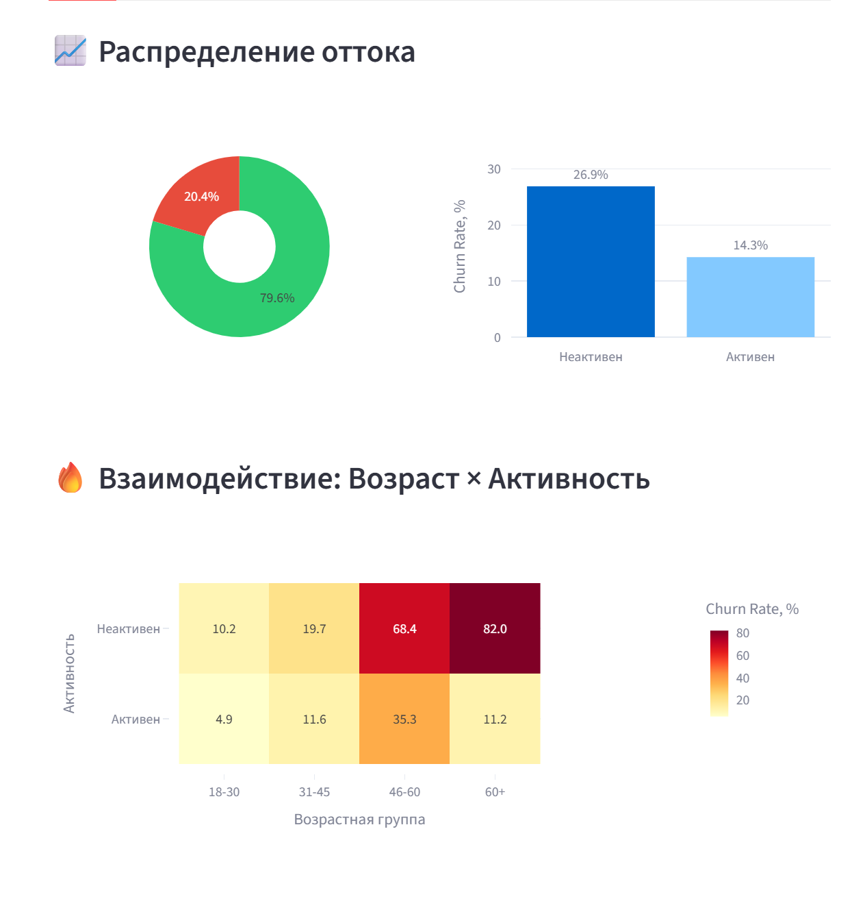

# 🏦 Анализ оттока клиентов банка (Bank Customer Churn)

End-to-end аналитический проект по выявлению факторов оттока клиентов финтех-сервиса. Проект включает загрузку данных, исследовательский анализ (EDA), проверку статистических гипотез и интерактивный дашборд для бизнеса.

---

## 📌 Описание проекта

**Цель:** Выявить ключевые факторы оттока клиентов и сформулировать рекомендации для бизнеса по их удержанию.

**Задачи:**
- ✅ Провести первичный анализ данных (EDA)
- ✅ Рассчитать ключевые метрики (Churn Rate)
- ✅ Проверить статистические гипотезы (t-test, χ²)
- ✅ Построить интерактивный дашборд в Streamlit
- ✅ Сформулировать бизнес-рекомендации

**Датасет:** [Bank Customer Churn Prediction](https://www.kaggle.com/datasets/bhuviranga/customer-churn-data/data) (10 000 записей, 12 признаков)

---

## 📁 Структура проекта

```
fintech-case/
├── data/
│   ├── raw/                          # Исходные данные
│   │   └── Bank Customer Churn Prediction.csv
│   └── processed/                    # Очищенные данные
│       └── customers_clean.csv
├── notebooks/
│   ├── 01_eda.ipynb                  # Первичный анализ данных
│   └── 02_metrics.ipynb              # Метрики и проверка гипотез
├── docs/
│   └── screenshots/                  # Скриншоты дашборда
├── app.py                            # Streamlit дашборд
├── requirements.txt                  # Зависимости
├── README.md                         # Этот файл
└── .gitignore                        # Игнорируемые файлы
```

---

## 🚀 Быстрый старт

### 1. Клонируйте репозиторий
```bash
git clone https://github.com/ВАШ_НИКНЕЙМ/fintech-case.git
cd fintech-case
```

### 2. Создайте виртуальное окружение
```bash
python -m venv venv
```

### 3. Активируйте окружение
**Windows:**
```bash
venv\Scripts\activate
```

**macOS/Linux:**
```bash
source venv/bin/activate
```

### 4. Установите зависимости
```bash
pip install -r requirements.txt
```

### 5. Запустите дашборд
```bash
streamlit run app.py
```

### 6. Откройте Jupyter Notebook
```bash
jupyter notebook notebooks/01_eda.ipynb
```

---

## 📊 Ключевые метрики

| Метрика | Значение |
|---------|----------|
| Всего клиентов | 10 000 |
| Ушло клиентов | 2 037 |
| **Churn Rate** | **20.37%** |
| Средний возраст | 38.9 лет |

---

## 🔍 Проверенные гипотезы

| № | Гипотеза | Статус | Ключевой инсайт |
|---|----------|--------|-----------------|
| 1 | Клиенты 46–60 лет уходят чаще | ✅ Подтверждена | Churn Rate = **51.12%** |
| 2 | U-образная кривая оттока по tenure: новые и «ветераны» уходят чаще | ❌ Не подтверждена | Нет статистически значимой разницы между группами клиентов по длительности отношений с банком |

---

## 🎯 Бизнес-рекомендации

### 🔴 Приоритет 1: Сегмент «46–60 лет + неактивен» (69.7% churn)
- **Триггер:** 30 дней неактивности → персональный контакт
- **Канал:** Телефон / email (не только push-уведомления)

### 🟡 Приоритет 2: Онбординг для 45+
- Упрощённый интерфейс
- Видео-гайд «Первые 5 минут в приложении»

### 🟢 Приоритет 3: Удержание активности
- Персонализированные уведомления о кэшбэке
- Простые цели: «1 оплата = бонус»
- **Метрика успеха:** % активных клиентов 45+

---

## 📈 Визуализации

### Churn Rate по длительности отношений с банком


### Churn Rate по возрасту


### Тепловая карта: Возраст × Активность


---

## 🛠️ Технологический стек

| Категория | Инструменты |
|-----------|-------------|
| **Язык** | Python 3.10+ |
| **Анализ данных** | pandas, numpy |
| **Визуализация** | matplotlib, seaborn, plotly |
| **Статистика** | scipy (t-test, χ²) |
| **Дашборд** | Streamlit |
| **Среда** | Jupyter Notebook, VS Code |

---

## 📋 Зависимости

Основные библиотеки указаны в `requirements.txt`:
```txt
pandas==2.0.3
numpy==1.24.3
matplotlib==3.7.2
seaborn==0.12.2
plotly==5.15.0
scipy==1.11.1
streamlit==1.25.0
jupyter==1.0.0
```

---

## 🔗 Ссылки

- **📊 Интерактивный дашборд:** [https://fintech-case-chernyshevm.streamlit.app/](https://fintech-case-chernyshevm.streamlit.app/)

---

## 👤 Автор

**Maksim Chernyshev**  
Data Analyst

- 📧 [Telegram](https://t.me/chernyshevm)
- 💼 [LinkedIn](https://www.linkedin.com/in/максим-чернышев-81493351/)
- 🐙 [GitHub](https://github.com/ChernyshevM)

---

## 🙏 Благодарности

- Датасет предоставлен сообществом Kaggle
- Проект создан в образовательных целях для портфолио аналитика данных

---

**Последнее обновление:** Март 2026